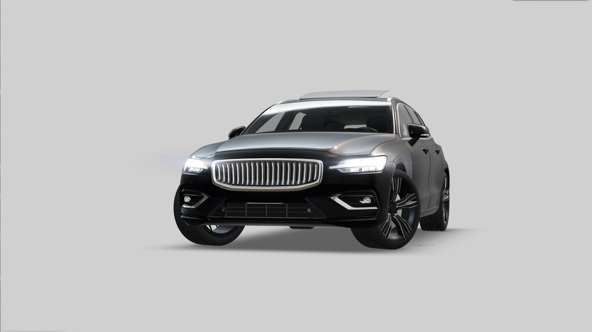
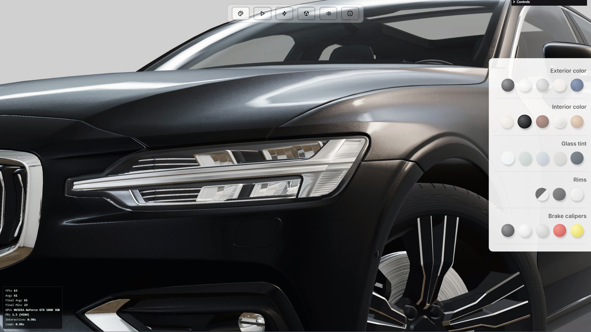
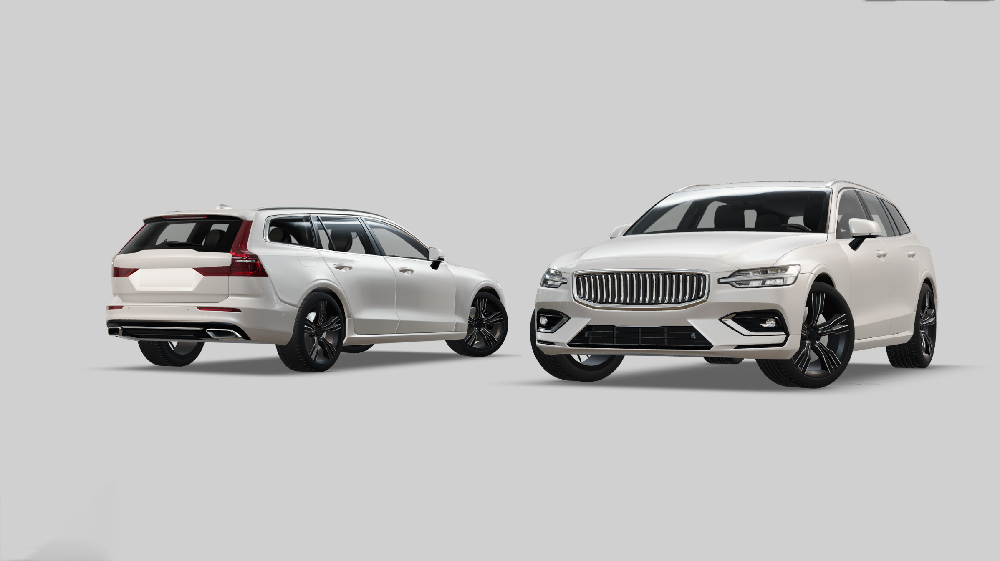
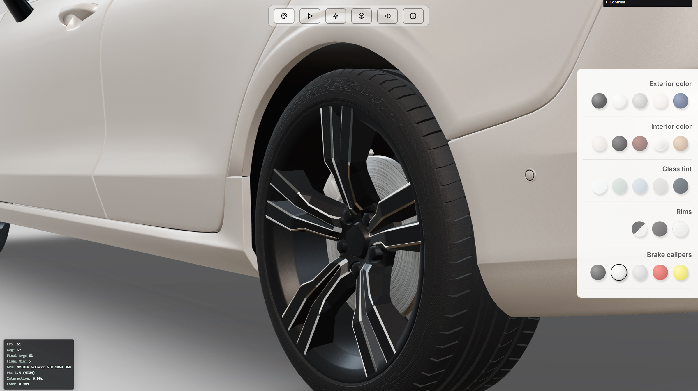
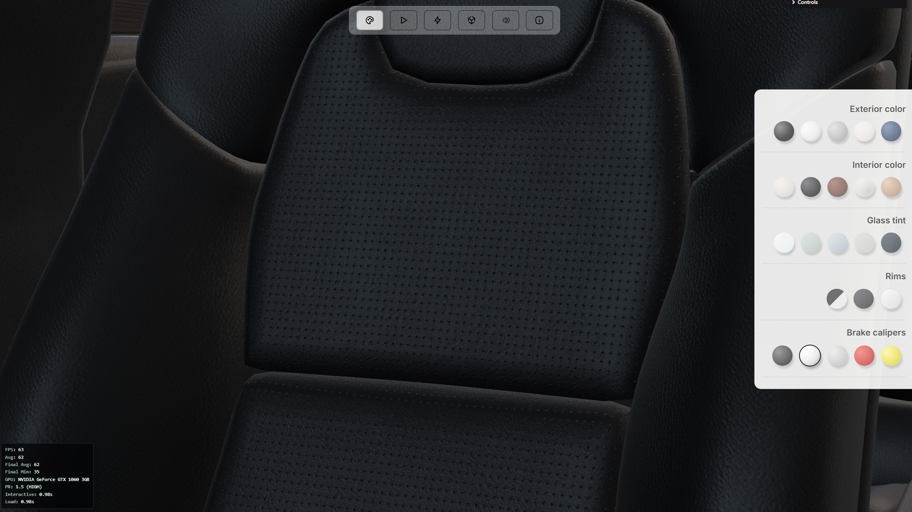
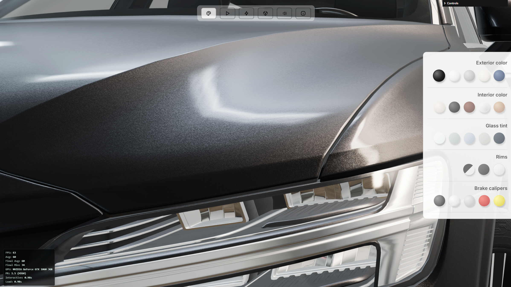
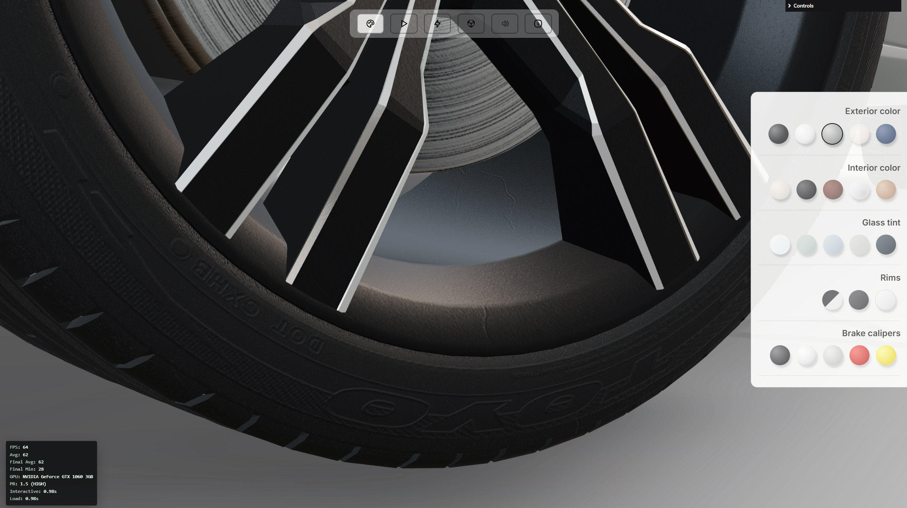
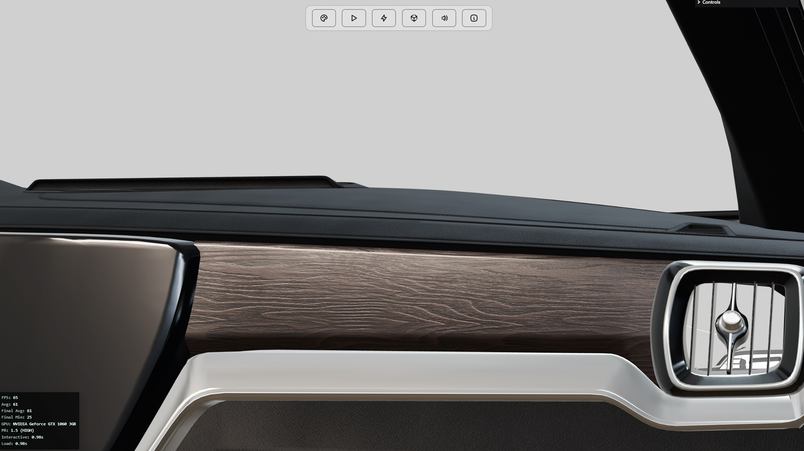

# PureDrive RT — Real-Time Car Configurator

Real-time 3D car configurator built with Three.js, focused on mobile performance, adaptive systems, and interactive customization.

---

---

## Key Results

- ~60 FPS stable performance on mid-range mobile devices  
- ~2s load time with optimized asset pipeline  
- Adaptive performance system (dynamic pixel ratio scaling)  
- Real-time material, rims, glass, and interior customization  
- Production-ready architecture with modular system design  

---

## Screenshots

### Exterior & Visual Quality

### Configurator UI

### Materials & Details

---

## Project Overview

PureDrive RT is a real-time web-based 3D car configurator designed to deliver high-quality interactive visualization directly in the browser.

The project focuses on building a **performance-driven system**, not just a visual demo — enabling smooth interaction, fast loading, and stable performance across both desktop and mobile devices.

---

## The Challenge

Building a real-time 3D configurator on the web introduces several technical challenges:

- Maintaining stable FPS on mid-range mobile devices  
- Managing heavy 3D assets efficiently  
- Supporting real-time customization without performance drops  
- Handling rendering cost across different devices  
- Delivering smooth UX and camera interaction  

---

## The Solution

The system was designed with a **performance-first architecture**, including:

- Multi-phase loading system  
- Adaptive rendering based on runtime performance  
- Optimized material pipeline  
- Efficient scene traversal and mesh handling  
- Lightweight UI directly connected to 3D logic  

---

## Core Systems

### Adaptive Performance System

Dynamic pixel ratio scaling based on real-time FPS:

- Automatic downscale when performance drops  
- Gradual upscale when performance stabilizes  
- Panic fallback for sudden FPS drops  

This ensures consistent experience across different hardware tiers.

---

### Real-Time Performance Monitoring

Custom performance system including:

- Live FPS tracking  
- Average and final FPS calculation  
- GPU detection  
- Load time & interaction time tracking  
- Scene complexity stats (meshes & triangles)  

All metrics are visualized directly in-app via a lightweight overlay.

---

### Interactive Configurator

Real-time UI directly connected to 3D scene:

- Exterior color switching  
- Interior material control  
- Glass tint variations  
- Rim configurations  
- Brake caliper customization  

All changes happen instantly without reload.

---

### Material System

Advanced use of MeshPhysicalMaterial:

- Car paint with layered normals (flakes effect)  
- Chrome and metallic surfaces  
- Glass with transmission and tint control  
- Leather materials with normal & roughness maps  
- Multi-layer shading for realism  

---

### Camera & Interaction System

- Smooth camera transitions using GSAP  
- Front / rear view switching  
- Demo cinematic mode  
- Intro camera animation flow  
- Controlled Orbit system for UX  

---

### Loading Pipeline

- THREE.LoadingManager-based system  
- Visual loading progress bar  
- Controlled intro sequence  
- Deferred interaction start after full load  

---

## Performance Strategy

The system is built with a **mobile-first mindset**:

- Dynamic pixel ratio scaling  
- Minimal post-processing  
- Optimized materials instead of heavy effects  
- Efficient rendering loop  
- Controlled UI updates  

---

## What I Built

- Real-time WebGL system architecture  
- Adaptive performance engine  
- Custom configurator UI  
- Material pipeline for automotive rendering  
- Camera system with cinematic transitions  
- Loading system with UX-focused flow  

---

## Outcome

The result is a **production-ready real-time 3D system** that demonstrates:

- Stable performance across devices  
- Scalable architecture for real-world applications  
- Balance between visual quality and performance  
- Practical WebGL system design beyond demos  

---

## Notes

This repository represents a **case study** of the system architecture and implementation.  
Source code and assets are not fully included.
